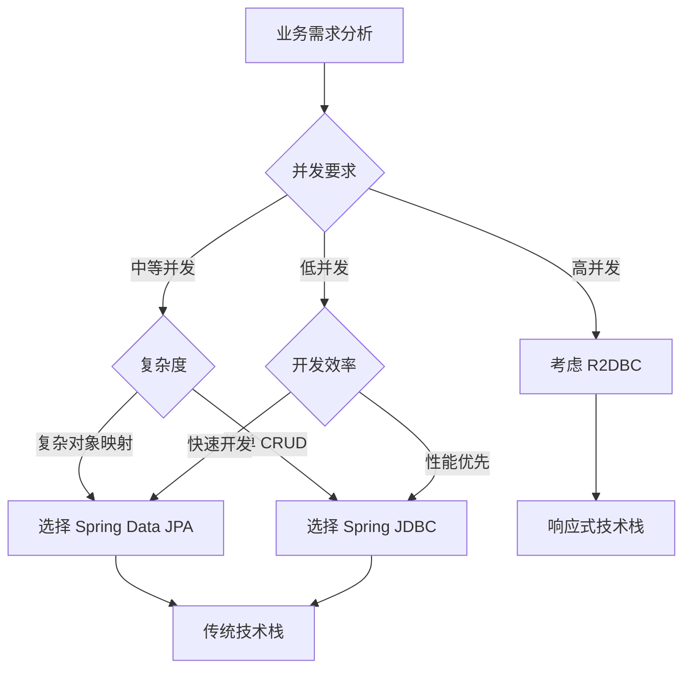

# Spring 数据访问技术总览

## 🎯 概述

Spring 数据访问是 Spring 框架的核心特性之一，提供了一套完整的数据访问解决方案。它通过统一的抽象层，简化了与不同数据源的交互，支持传统的关系型数据库、NoSQL 数据库、以及响应式数据访问。Spring 数据访问的核心在于事务管理、数据访问对象（DAO）支持、以及与各种持久化技术的无缝集成。

> **💡 深入学习指南**
> 
> 本文档提供 Spring 数据访问技术的总览，如需深入学习特定技术，请参考以下专题文档：
> 
> - 📖 [Spring 事务管理深度剖析](./Spring%20事务管理深度剖析.md) - 深入理解事务管理机制和最佳实践
> - 📖 [Spring JDBC 与数据源管理详解](./Spring%20JDBC%20与数据源管理详解.md) - 掌握 JDBC 操作和连接池优化
> - 📖 [Spring Data JPA 企业级实战](./Spring%20Data%20JPA%20企业级实战.md) - 学习 JPA 高级特性和性能优化
> - 📖 [Spring 响应式数据访问(R2DBC)详解](./Spring%20响应式数据访问(R2DBC)详解.md) - 探索响应式数据访问技术

## 📚 数据访问架构概览

### 数据访问层次结构

```
应用层 (Application Layer)
    ↓
业务服务层 (Service Layer)
    ↓
数据访问层 (Data Access Layer)
├── 事务管理 (Transaction Management)
├── DAO 支持 (DAO Support)
├── JDBC 支持 (JDBC Support)
├── ORM 集成 (ORM Integration)
└── 响应式支持 (Reactive Support)
    ↓
数据存储层 (Data Storage Layer)
```

### 核心组件关系

```
DataAccessException (异常体系)
    ↑
TransactionManager (事务管理器)
    ↑
DataSource (数据源)
    ↑
JdbcTemplate / JpaRepository / R2dbcRepository
    ↑
Business Service (业务服务)
```

## 🔄 Spring 事务管理详解

### 1. 事务管理架构

Spring 提供了一套完整的事务管理抽象，支持编程式和声明式事务管理。

#### 事务管理器层次结构

```java
// 事务管理器接口
public interface TransactionManager {
    // 标记接口
}

// 平台事务管理器
public interface PlatformTransactionManager extends TransactionManager {
    TransactionStatus getTransaction(TransactionDefinition definition) throws TransactionException;
    void commit(TransactionStatus status) throws TransactionException;
    void rollback(TransactionStatus status) throws TransactionException;
}

// 响应式事务管理器
public interface ReactiveTransactionManager extends TransactionManager {
    Mono<ReactiveTransaction> getReactiveTransaction(TransactionDefinition definition) throws TransactionException;
    Mono<Void> commit(ReactiveTransaction transaction) throws TransactionException;
    Mono<Void> rollback(ReactiveTransaction transaction) throws TransactionException;
}
```

#### 常用事务管理器实现

```java
@Configuration
@EnableTransactionManagement
public class TransactionConfig {

    // JDBC 事务管理器
    @Bean
    @Primary
    public PlatformTransactionManager dataSourceTransactionManager(DataSource dataSource) {
        return new DataSourceTransactionManager(dataSource);
    }

    // JPA 事务管理器
    @Bean
    public PlatformTransactionManager jpaTransactionManager(EntityManagerFactory entityManagerFactory) {
        JpaTransactionManager transactionManager = new JpaTransactionManager();
        transactionManager.setEntityManagerFactory(entityManagerFactory);
        return transactionManager;
    }

    // JTA 事务管理器（分布式事务）
    @Bean
    public PlatformTransactionManager jtaTransactionManager() {
        return new JtaTransactionManager();
    }

    // 响应式事务管理器
    @Bean
    public ReactiveTransactionManager r2dbcTransactionManager(ConnectionFactory connectionFactory) {
        return new R2dbcTransactionManager(connectionFactory);
    }
}
```

### 2. 声明式事务管理

#### @Transactional 注解详解

```java
@Service
public class UserService {

    // 基础事务配置
    @Transactional
    public User createUser(User user) {
        // 默认：传播行为 REQUIRED，隔离级别 DEFAULT，读写事务
        return userRepository.save(user);
    }

    // 完整事务配置
    @Transactional(
        propagation = Propagation.REQUIRES_NEW,    // 传播行为
        isolation = Isolation.READ_COMMITTED,      // 隔离级别
        timeout = 30,                              // 超时时间（秒）
        readOnly = false,                          // 是否只读
        rollbackFor = {Exception.class},           // 触发回滚的异常
        noRollbackFor = {IllegalArgumentException.class}  // 不触发回滚的异常
    )
    public void complexTransaction(User user) {
        userRepository.save(user);
        // 复杂业务逻辑
    }

    // 只读事务（优化性能）
    @Transactional(readOnly = true)
    public List<User> findAllUsers() {
        return userRepository.findAll();
    }

    // 不同传播行为示例
    @Transactional(propagation = Propagation.SUPPORTS)
    public User findUserById(Long id) {
        // 如果存在事务则加入，否则以非事务方式执行
        return userRepository.findById(id);
    }
}
```

#### 事务传播行为详解

```java
@Service
public class TransactionPropagationDemo {

    @Autowired
    private UserService userService;

    @Autowired
    private OrderService orderService;

    // REQUIRED：加入当前事务，如果没有事务则创建新事务
    @Transactional
    public void requiredExample() {
        userService.createUser(new User("张三"));     // T1
        orderService.createOrder(new Order());       // 加入 T1
    }

    // REQUIRES_NEW：始终创建新事务，暂停当前事务
    @Transactional
    public void requiresNewExample() {
        userService.createUser(new User("李四"));     // T1
        orderService.createOrderWithNewTransaction(new Order()); // T2（新事务）
        // T1 继续执行
    }

    // NESTED：嵌套事务，基于保存点实现
    @Transactional
    public void nestedExample() {
        userService.createUser(new User("王五"));     // T1
        try {
            orderService.createNestedOrder(new Order()); // T1 的嵌套事务
        } catch (Exception e) {
            // 嵌套事务回滚，主事务可以继续
            System.out.println("嵌套事务失败，但主事务继续");
        }
    }
}

@Service
public class OrderService {

    @Transactional(propagation = Propagation.REQUIRES_NEW)
    public Order createOrderWithNewTransaction(Order order) {
        return orderRepository.save(order);
    }

    @Transactional(propagation = Propagation.NESTED)
    public Order createNestedOrder(Order order) {
        return orderRepository.save(order);
    }
}
```

#### 事务隔离级别与并发问题

```java
@Service
public class IsolationLevelDemo {

    // 读未提交 - 可能出现脏读
    @Transactional(isolation = Isolation.READ_UNCOMMITTED)
    public void readUncommittedExample() {
        // 可以读取其他事务未提交的数据
    }

    // 读已提交 - 避免脏读，但可能出现不可重复读
    @Transactional(isolation = Isolation.READ_COMMITTED)
    public void readCommittedExample() {
        User user1 = userRepository.findById(1L);
        // 其他事务可能修改了用户数据
        User user2 = userRepository.findById(1L);
        // user1 和 user2 可能不同
    }

    // 可重复读 - 避免脏读和不可重复读，但可能出现幻读
    @Transactional(isolation = Isolation.REPEATABLE_READ)
    public void repeatableReadExample() {
        List<User> users1 = userRepository.findAll();
        // 其他事务可能插入新用户
        List<User> users2 = userRepository.findAll();
        // users2 可能比 users1 多（幻读）
    }

    // 序列化 - 最高隔离级别，避免所有并发问题，但性能最低
    @Transactional(isolation = Isolation.SERIALIZABLE)
    public void serializableExample() {
        // 完全隔离，但并发性能差
        userRepository.findAll();
    }
}
```

### 3. 编程式事务管理

#### 使用 TransactionTemplate

```java
@Service
public class ProgrammaticTransactionService {

    private final TransactionTemplate transactionTemplate;
    private final UserRepository userRepository;

    public ProgrammaticTransactionService(PlatformTransactionManager transactionManager,
                                        UserRepository userRepository) {
        this.transactionTemplate = new TransactionTemplate(transactionManager);
        this.userRepository = userRepository;
    }

    // 有返回值的事务操作
    public User createUserProgrammatically(User user) {
        return transactionTemplate.execute(status -> {
            try {
                User savedUser = userRepository.save(user);
                // 复杂的业务逻辑
                if (savedUser.getName().equals("error")) {
                    throw new RuntimeException("模拟异常");
                }
                return savedUser;
            } catch (Exception e) {
                status.setRollbackOnly(); // 手动标记回滚
                throw e;
            }
        });
    }

    // 无返回值的事务操作
    public void updateUserProgrammatically(Long userId, String newName) {
        transactionTemplate.executeWithoutResult(status -> {
            User user = userRepository.findById(userId)
                .orElseThrow(() -> new RuntimeException("用户不存在"));
            user.setName(newName);
            userRepository.save(user);
        });
    }

    // 自定义事务配置
    public User createUserWithCustomTransaction(User user) {
        TransactionTemplate customTemplate = new TransactionTemplate(transactionTemplate.getTransactionManager());
        customTemplate.setPropagationBehavior(TransactionDefinition.PROPAGATION_REQUIRES_NEW);
        customTemplate.setIsolationLevel(TransactionDefinition.ISOLATION_READ_COMMITTED);
        customTemplate.setTimeout(30);

        return customTemplate.execute(status -> userRepository.save(user));
    }
}
```

#### 使用 PlatformTransactionManager

```java
@Service
public class LowLevelTransactionService {

    private final PlatformTransactionManager transactionManager;
    private final UserRepository userRepository;

    public LowLevelTransactionService(PlatformTransactionManager transactionManager,
                                    UserRepository userRepository) {
        this.transactionManager = transactionManager;
        this.userRepository = userRepository;
    }

    public User createUserWithManualTransaction(User user) {
        // 定义事务属性
        DefaultTransactionDefinition definition = new DefaultTransactionDefinition();
        definition.setPropagationBehavior(TransactionDefinition.PROPAGATION_REQUIRED);
        definition.setIsolationLevel(TransactionDefinition.ISOLATION_READ_COMMITTED);
        definition.setTimeout(30);

        // 获取事务状态
        TransactionStatus status = transactionManager.getTransaction(definition);

        try {
            User savedUser = userRepository.save(user);
            // 业务逻辑
            
            // 提交事务
            transactionManager.commit(status);
            return savedUser;
        } catch (Exception e) {
            // 回滚事务
            transactionManager.rollback(status);
            throw e;
        }
    }
}
```

### 4. 响应式事务管理

```java
@Service
public class ReactiveTransactionService {

    private final ReactiveTransactionManager transactionManager;
    private final R2dbcEntityTemplate entityTemplate;

    public ReactiveTransactionService(ReactiveTransactionManager transactionManager,
                                    R2dbcEntityTemplate entityTemplate) {
        this.transactionManager = transactionManager;
        this.entityTemplate = entityTemplate;
    }

    // 响应式声明式事务
    @Transactional
    public Mono<User> createUserReactive(User user) {
        return entityTemplate.insert(user);
    }

    // 响应式编程式事务
    public Mono<User> createUserReactiveProgrammatic(User user) {
        return transactionManager
            .getReactiveTransaction(new DefaultTransactionDefinition())
            .flatMap(transaction -> 
                entityTemplate.insert(user)
                    .flatMap(savedUser -> 
                        transactionManager.commit(transaction)
                            .thenReturn(savedUser)
                    )
                    .onErrorResume(error -> 
                        transactionManager.rollback(transaction)
                            .then(Mono.error(error))
                    )
            );
    }

    // 响应式事务链式操作
    @Transactional
    public Mono<String> complexReactiveTransaction(User user, Order order) {
        return entityTemplate.insert(user)
            .flatMap(savedUser -> {
                order.setUserId(savedUser.getId());
                return entityTemplate.insert(order);
            })
            .map(savedOrder -> "用户和订单创建成功: " + savedOrder.getId());
    }
}
```

## 🗄️ Spring JDBC 支持

### 1. JdbcTemplate 核心功能

```java
@Repository
public class UserJdbcRepository {

    private final JdbcTemplate jdbcTemplate;
    private final NamedParameterJdbcTemplate namedParameterJdbcTemplate;

    public UserJdbcRepository(JdbcTemplate jdbcTemplate) {
        this.jdbcTemplate = jdbcTemplate;
        this.namedParameterJdbcTemplate = new NamedParameterJdbcTemplate(jdbcTemplate);
    }

    // 查询单个对象
    public User findById(Long id) {
        String sql = "SELECT id, name, email, age FROM users WHERE id = ?";
        return jdbcTemplate.queryForObject(sql, this::mapRowToUser, id);
    }

    // 查询对象列表
    public List<User> findAll() {
        String sql = "SELECT id, name, email, age FROM users";
        return jdbcTemplate.query(sql, this::mapRowToUser);
    }

    // 分页查询
    public Page<User> findUsers(Pageable pageable) {
        String countSql = "SELECT COUNT(*) FROM users";
        int total = jdbcTemplate.queryForObject(countSql, Integer.class);

        String dataSql = "SELECT id, name, email, age FROM users ORDER BY id LIMIT ? OFFSET ?";
        List<User> users = jdbcTemplate.query(dataSql, this::mapRowToUser,
            pageable.getPageSize(), pageable.getOffset());

        return new PageImpl<>(users, pageable, total);
    }

    // 条件查询
    public List<User> findByAgeRange(int minAge, int maxAge) {
        String sql = "SELECT id, name, email, age FROM users WHERE age BETWEEN ? AND ?";
        return jdbcTemplate.query(sql, this::mapRowToUser, minAge, maxAge);
    }

    // 使用命名参数
    public List<User> findByNameAndEmail(String name, String email) {
        String sql = "SELECT id, name, email, age FROM users WHERE name = :name AND email = :email";
        
        MapSqlParameterSource params = new MapSqlParameterSource()
            .addValue("name", name)
            .addValue("email", email);

        return namedParameterJdbcTemplate.query(sql, params, this::mapRowToUser);
    }

    // 插入数据
    public User save(User user) {
        if (user.getId() == null) {
            return insert(user);
        } else {
            return update(user);
        }
    }

    private User insert(User user) {
        String sql = "INSERT INTO users (name, email, age) VALUES (?, ?, ?)";
        
        KeyHolder keyHolder = new GeneratedKeyHolder();
        jdbcTemplate.update(connection -> {
            PreparedStatement ps = connection.prepareStatement(sql, Statement.RETURN_GENERATED_KEYS);
            ps.setString(1, user.getName());
            ps.setString(2, user.getEmail());
            ps.setInt(3, user.getAge());
            return ps;
        }, keyHolder);

        user.setId(Objects.requireNonNull(keyHolder.getKey()).longValue());
        return user;
    }

    private User update(User user) {
        String sql = "UPDATE users SET name = ?, email = ?, age = ? WHERE id = ?";
        int rowsAffected = jdbcTemplate.update(sql, 
            user.getName(), user.getEmail(), user.getAge(), user.getId());
        
        if (rowsAffected == 0) {
            throw new RuntimeException("用户不存在: " + user.getId());
        }
        return user;
    }

    // 批量操作
    public void batchInsert(List<User> users) {
        String sql = "INSERT INTO users (name, email, age) VALUES (?, ?, ?)";
        
        jdbcTemplate.batchUpdate(sql, new BatchPreparedStatementSetter() {
            @Override
            public void setValues(PreparedStatement ps, int i) throws SQLException {
                User user = users.get(i);
                ps.setString(1, user.getName());
                ps.setString(2, user.getEmail());
                ps.setInt(3, user.getAge());
            }

            @Override
            public int getBatchSize() {
                return users.size();
            }
        });
    }

    // 删除操作
    public void deleteById(Long id) {
        String sql = "DELETE FROM users WHERE id = ?";
        int rowsAffected = jdbcTemplate.update(sql, id);
        
        if (rowsAffected == 0) {
            throw new RuntimeException("用户不存在: " + id);
        }
    }

    // 行映射器
    private User mapRowToUser(ResultSet rs, int rowNum) throws SQLException {
        User user = new User();
        user.setId(rs.getLong("id"));
        user.setName(rs.getString("name"));
        user.setEmail(rs.getString("email"));
        user.setAge(rs.getInt("age"));
        return user;
    }

    // 复杂查询示例
    public Map<String, Object> getUserStatistics() {
        String sql = """
            SELECT 
                COUNT(*) as total_users,
                AVG(age) as average_age,
                MIN(age) as min_age,
                MAX(age) as max_age
            FROM users
            """;
        
        return jdbcTemplate.queryForMap(sql);
    }

    // 存储过程调用
    public void callStoredProcedure(Long userId) {
        String sql = "{call update_user_last_login(?)}";
        jdbcTemplate.update(sql, userId);
    }
}
```

### 2. SimpleJdbc 类的使用

```java
@Repository
public class SimpleJdbcUserRepository {

    private final SimpleJdbcInsert simpleJdbcInsert;
    private final SimpleJdbcCall simpleJdbcCall;
    private final JdbcTemplate jdbcTemplate;

    public SimpleJdbcUserRepository(DataSource dataSource) {
        this.jdbcTemplate = new JdbcTemplate(dataSource);
        
        // 配置 SimpleJdbcInsert
        this.simpleJdbcInsert = new SimpleJdbcInsert(dataSource)
            .withTableName("users")
            .usingGeneratedKeyColumns("id");
        
        // 配置 SimpleJdbcCall
        this.simpleJdbcCall = new SimpleJdbcCall(dataSource)
            .withProcedureName("get_user_by_email");
    }

    // 使用 SimpleJdbcInsert 插入数据
    public User insertUser(User user) {
        Map<String, Object> parameters = new HashMap<>();
        parameters.put("name", user.getName());
        parameters.put("email", user.getEmail());
        parameters.put("age", user.getAge());

        Number newId = simpleJdbcInsert.executeAndReturnKey(parameters);
        user.setId(newId.longValue());
        return user;
    }

    // 批量插入
    public void batchInsertUsers(List<User> users) {
        Map<String, Object>[] batchValues = users.stream()
            .map(user -> {
                Map<String, Object> params = new HashMap<>();
                params.put("name", user.getName());
                params.put("email", user.getEmail());
                params.put("age", user.getAge());
                return params;
            })
            .toArray(Map[]::new);

        simpleJdbcInsert.executeBatch(batchValues);
    }

    // 使用 SimpleJdbcCall 调用存储过程
    public User findByEmailUsingProcedure(String email) {
        Map<String, Object> inParams = new HashMap<>();
        inParams.put("p_email", email);

        Map<String, Object> result = simpleJdbcCall.execute(inParams);
        
        if (result.containsKey("user_id")) {
            User user = new User();
            user.setId(((Number) result.get("user_id")).longValue());
            user.setName((String) result.get("user_name"));
            user.setEmail((String) result.get("user_email"));
            user.setAge(((Number) result.get("user_age")).intValue());
            return user;
        }
        return null;
    }
}
```

### 3. 数据源配置与连接池管理

```java
@Configuration
public class DataSourceConfig {

    // HikariCP 连接池（推荐）
    @Bean
    @Primary
    @ConfigurationProperties(prefix = "spring.datasource.primary")
    public DataSource primaryDataSource() {
        return DataSourceBuilder.create()
            .type(HikariDataSource.class)
            .build();
    }

    // 多数据源配置
    @Bean
    @ConfigurationProperties(prefix = "spring.datasource.secondary")
    public DataSource secondaryDataSource() {
        return DataSourceBuilder.create()
            .type(HikariDataSource.class)
            .build();
    }

    // 主数据源的 JdbcTemplate
    @Bean
    @Primary
    public JdbcTemplate primaryJdbcTemplate(@Qualifier("primaryDataSource") DataSource dataSource) {
        return new JdbcTemplate(dataSource);
    }

    // 次数据源的 JdbcTemplate
    @Bean
    public JdbcTemplate secondaryJdbcTemplate(@Qualifier("secondaryDataSource") DataSource dataSource) {
        return new JdbcTemplate(dataSource);
    }

    // 手动配置 HikariCP
    @Bean
    public DataSource customDataSource(@Value("${app.datasource.url}") String url,
                                     @Value("${app.datasource.username}") String username,
                                     @Value("${app.datasource.password}") String password) {
        HikariConfig config = new HikariConfig();
        config.setJdbcUrl(url);
        config.setUsername(username);
        config.setPassword(password);
        
        // 连接池配置
        config.setMaximumPoolSize(20);                    // 最大连接数
        config.setMinimumIdle(5);                         // 最小空闲连接数
        config.setConnectionTimeout(30000);               // 连接超时时间
        config.setIdleTimeout(600000);                    // 空闲超时时间
        config.setMaxLifetime(1800000);                   // 连接最大生命周期
        config.setLeakDetectionThreshold(60000);          // 连接泄漏检测阈值
        
        // 连接池监控
        config.setRegisterMbeans(true);
        
        // 连接测试
        config.setConnectionTestQuery("SELECT 1");
        
        return new HikariDataSource(config);
    }
}
```

## 🏛️ Spring ORM 集成

### 1. Spring Data JPA 集成

```java
// 实体类定义
@Entity
@Table(name = "users")
public class User {
    @Id
    @GeneratedValue(strategy = GenerationType.IDENTITY)
    private Long id;

    @Column(nullable = false, length = 100)
    private String name;

    @Column(unique = true, nullable = false)
    private String email;

    @Column
    private Integer age;

    @CreationTimestamp
    private LocalDateTime createdAt;

    @UpdateTimestamp
    private LocalDateTime updatedAt;

    // 一对多关系
    @OneToMany(mappedBy = "user", cascade = CascadeType.ALL, fetch = FetchType.LAZY)
    private List<Order> orders = new ArrayList<>();

    // Getters and Setters
}

@Entity
@Table(name = "orders")
public class Order {
    @Id
    @GeneratedValue(strategy = GenerationType.IDENTITY)
    private Long id;

    @Column(nullable = false)
    private String orderNumber;

    @Column(nullable = false)
    private BigDecimal amount;

    @ManyToOne(fetch = FetchType.LAZY)
    @JoinColumn(name = "user_id")
    private User user;

    // Getters and Setters
}
```

```java
// Repository 接口
public interface UserRepository extends JpaRepository<User, Long>, JpaSpecificationExecutor<User> {
    
    // 基础查询方法
    Optional<User> findByEmail(String email);
    
    List<User> findByNameContaining(String name);
    
    List<User> findByAgeBetween(Integer minAge, Integer maxAge);
    
    // 自定义查询
    @Query("SELECT u FROM User u WHERE u.age > :age ORDER BY u.createdAt DESC")
    List<User> findUsersOlderThan(@Param("age") Integer age);
    
    // 原生 SQL 查询
    @Query(value = "SELECT * FROM users WHERE name LIKE %:name%", nativeQuery = true)
    List<User> findByNameNative(@Param("name") String name);
    
    // 修改查询
    @Modifying
    @Transactional
    @Query("UPDATE User u SET u.age = :age WHERE u.id = :id")
    int updateUserAge(@Param("id") Long id, @Param("age") Integer age);
    
    // 删除查询
    @Modifying
    @Transactional
    void deleteByEmail(String email);
    
    // 分页查询
    Page<User> findByNameContaining(String name, Pageable pageable);
    
    // 投影查询
    @Query("SELECT u.name as name, u.email as email FROM User u WHERE u.age > :age")
    List<UserProjection> findUserProjections(@Param("age") Integer age);
    
    interface UserProjection {
        String getName();
        String getEmail();
    }
}
```

```java
// 高级 Repository 实现
@Repository
public class UserRepositoryImpl implements UserRepositoryCustom {

    @PersistenceContext
    private EntityManager entityManager;

    @Override
    public List<User> findUsersByCriteria(UserSearchCriteria criteria) {
        CriteriaBuilder cb = entityManager.getCriteriaBuilder();
        CriteriaQuery<User> query = cb.createQuery(User.class);
        Root<User> root = query.from(User.class);

        List<Predicate> predicates = new ArrayList<>();

        if (criteria.getName() != null && !criteria.getName().isEmpty()) {
            predicates.add(cb.like(cb.lower(root.get("name")), 
                "%" + criteria.getName().toLowerCase() + "%"));
        }

        if (criteria.getMinAge() != null) {
            predicates.add(cb.greaterThanOrEqualTo(root.get("age"), criteria.getMinAge()));
        }

        if (criteria.getMaxAge() != null) {
            predicates.add(cb.lessThanOrEqualTo(root.get("age"), criteria.getMaxAge()));
        }

        if (criteria.getEmail() != null && !criteria.getEmail().isEmpty()) {
            predicates.add(cb.equal(root.get("email"), criteria.getEmail()));
        }

        query.where(predicates.toArray(new Predicate[0]));
        query.orderBy(cb.desc(root.get("createdAt")));

        return entityManager.createQuery(query).getResultList();
    }

    @Override
    public Page<User> findUsersWithSpecs(Specification<User> spec, Pageable pageable) {
        // 使用 Specification 进行动态查询
        return null; // 在实际的 Repository 中实现
    }
}

// Specification 示例
public class UserSpecifications {

    public static Specification<User> hasName(String name) {
        return (root, query, cb) -> 
            name == null ? null : cb.like(cb.lower(root.get("name")), 
                "%" + name.toLowerCase() + "%");
    }

    public static Specification<User> hasAge(Integer age) {
        return (root, query, cb) -> 
            age == null ? null : cb.equal(root.get("age"), age);
    }

    public static Specification<User> ageBetween(Integer minAge, Integer maxAge) {
        return (root, query, cb) -> {
            if (minAge == null && maxAge == null) {
                return null;
            }
            if (minAge == null) {
                return cb.lessThanOrEqualTo(root.get("age"), maxAge);
            }
            if (maxAge == null) {
                return cb.greaterThanOrEqualTo(root.get("age"), minAge);
            }
            return cb.between(root.get("age"), minAge, maxAge);
        };
    }

    public static Specification<User> createdAfter(LocalDateTime date) {
        return (root, query, cb) -> 
            date == null ? null : cb.greaterThan(root.get("createdAt"), date);
    }
}
```

### 2. JPA 配置与优化

```java
@Configuration
@EnableJpaRepositories(basePackages = "com.example.repository")
@EnableTransactionManagement
public class JpaConfig {

    @Bean
    public LocalContainerEntityManagerFactoryBean entityManagerFactory(DataSource dataSource) {
        LocalContainerEntityManagerFactoryBean em = new LocalContainerEntityManagerFactoryBean();
        em.setDataSource(dataSource);
        em.setPackagesToScan("com.example.entity");

        HibernateJpaVendorAdapter vendorAdapter = new HibernateJpaVendorAdapter();
        em.setJpaVendorAdapter(vendorAdapter);

        Properties properties = new Properties();
        // Hibernate 配置
        properties.setProperty("hibernate.hbm2ddl.auto", "validate");
        properties.setProperty("hibernate.dialect", "org.hibernate.dialect.MySQL8Dialect");
        properties.setProperty("hibernate.show_sql", "false");
        properties.setProperty("hibernate.format_sql", "true");
        
        // 性能优化配置
        properties.setProperty("hibernate.jdbc.batch_size", "25");
        properties.setProperty("hibernate.order_inserts", "true");
        properties.setProperty("hibernate.order_updates", "true");
        properties.setProperty("hibernate.jdbc.batch_versioned_data", "true");
        
        // 二级缓存配置
        properties.setProperty("hibernate.cache.use_second_level_cache", "true");
        properties.setProperty("hibernate.cache.use_query_cache", "true");
        properties.setProperty("hibernate.cache.region.factory_class", 
            "org.hibernate.cache.ehcache.EhCacheRegionFactory");
        
        // 统计信息
        properties.setProperty("hibernate.generate_statistics", "true");
        
        em.setJpaProperties(properties);
        return em;
    }

    @Bean
    public PlatformTransactionManager transactionManager(EntityManagerFactory emf) {
        JpaTransactionManager transactionManager = new JpaTransactionManager();
        transactionManager.setEntityManagerFactory(emf);
        return transactionManager;
    }
}
```

### 3. 响应式数据访问（R2DBC）

```java
// R2DBC 配置
@Configuration
@EnableR2dbcRepositories
public class R2dbcConfig extends AbstractR2dbcConfiguration {

    @Override
    public ConnectionFactory connectionFactory() {
        return ConnectionFactories.get(ConnectionFactoryOptions.builder()
            .option(DRIVER, "mysql")
            .option(HOST, "localhost")
            .option(PORT, 3306)
            .option(USER, "username")
            .option(PASSWORD, "password")
            .option(DATABASE, "testdb")
            .build());
    }

    @Bean
    public ReactiveTransactionManager transactionManager(ConnectionFactory connectionFactory) {
        return new R2dbcTransactionManager(connectionFactory);
    }
}

// 响应式 Repository
public interface ReactiveUserRepository extends R2dbcRepository<User, Long> {
    
    Flux<User> findByNameContaining(String name);
    
    Mono<User> findByEmail(String email);
    
    @Query("SELECT * FROM users WHERE age > :age")
    Flux<User> findUsersOlderThan(@Param("age") Integer age);
    
    @Modifying
    @Query("UPDATE users SET age = :age WHERE id = :id")
    Mono<Integer> updateUserAge(@Param("id") Long id, @Param("age") Integer age);
}

// 响应式服务
@Service
public class ReactiveUserService {

    private final ReactiveUserRepository userRepository;
    private final R2dbcEntityTemplate entityTemplate;

    public ReactiveUserService(ReactiveUserRepository userRepository,
                             R2dbcEntityTemplate entityTemplate) {
        this.userRepository = userRepository;
        this.entityTemplate = entityTemplate;
    }

    @Transactional
    public Mono<User> createUser(User user) {
        return userRepository.save(user)
            .doOnSuccess(savedUser -> 
                System.out.println("用户创建成功: " + savedUser.getId()));
    }

    public Flux<User> findUsersByAge(Integer minAge, Integer maxAge) {
        return userRepository.findAll()
            .filter(user -> user.getAge() >= minAge && user.getAge() <= maxAge)
            .take(100); // 限制结果数量
    }

    // 复杂的响应式查询
    public Mono<Map<String, Long>> getUserStatistics() {
        return userRepository.findAll()
            .groupBy(user -> user.getAge() / 10 * 10) // 按年龄段分组
            .flatMap(group -> 
                group.count()
                    .map(count -> Map.entry(group.key() + "岁段", count))
            )
            .collectMap(Map.Entry::getKey, Map.Entry::getValue);
    }

    // 响应式批量操作
    @Transactional
    public Flux<User> batchCreateUsers(Flux<User> users) {
        return users
            .buffer(10) // 每10个一批
            .flatMap(userBatch -> 
                userRepository.saveAll(userBatch)
                    .doOnNext(savedUser -> 
                        System.out.println("批量保存用户: " + savedUser.getId()))
            );
    }

    // 使用 R2dbcEntityTemplate 进行复杂查询
    public Flux<User> findUsersByCustomCriteria(String name, Integer age) {
        return entityTemplate
            .select(User.class)
            .matching(query(where("name").like("%" + name + "%")
                .and("age").greaterThan(age)))
            .all();
    }
}
```

## 🚀 数据访问最佳实践

### 1. 异常处理与错误管理

```java
// 数据访问异常处理
@ControllerAdvice
public class DataAccessExceptionHandler {

    private static final Logger logger = LoggerFactory.getLogger(DataAccessExceptionHandler.class);

    @ExceptionHandler(DataIntegrityViolationException.class)
    public ResponseEntity<ErrorResponse> handleDataIntegrityViolation(DataIntegrityViolationException e) {
        logger.error("数据完整性违规", e);
        
        String message = "数据保存失败";
        if (e.getCause() instanceof ConstraintViolationException) {
            message = "数据约束冲突";
        }
        
        return ResponseEntity.badRequest()
            .body(new ErrorResponse("DATA_INTEGRITY_ERROR", message));
    }

    @ExceptionHandler(OptimisticLockingFailureException.class)
    public ResponseEntity<ErrorResponse> handleOptimisticLocking(OptimisticLockingFailureException e) {
        logger.warn("乐观锁冲突", e);
        return ResponseEntity.status(HttpStatus.CONFLICT)
            .body(new ErrorResponse("OPTIMISTIC_LOCK_ERROR", "数据已被其他用户修改，请刷新后重试"));
    }

    @ExceptionHandler(CannotAcquireLockException.class)
    public ResponseEntity<ErrorResponse> handleCannotAcquireLock(CannotAcquireLockException e) {
        logger.error("无法获取数据库锁", e);
        return ResponseEntity.status(HttpStatus.SERVICE_UNAVAILABLE)
            .body(new ErrorResponse("LOCK_TIMEOUT_ERROR", "系统繁忙，请稍后重试"));
    }

    @ExceptionHandler(DataAccessResourceFailureException.class)
    public ResponseEntity<ErrorResponse> handleDataAccessResourceFailure(DataAccessResourceFailureException e) {
        logger.error("数据访问资源失败", e);
        return ResponseEntity.status(HttpStatus.SERVICE_UNAVAILABLE)
            .body(new ErrorResponse("DATABASE_ERROR", "数据库连接异常"));
    }
}

// 自定义数据访问异常
public class UserNotFoundException extends RuntimeException {
    public UserNotFoundException(Long userId) {
        super("用户不存在: " + userId);
    }
}

public class DuplicateEmailException extends RuntimeException {
    public DuplicateEmailException(String email) {
        super("邮箱已存在: " + email);
    }
}
```

### 2. 数据访问层设计模式

```java
// Repository 模式实现
public interface UserRepository extends JpaRepository<User, Long> {
    // 基础 CRUD 操作由 JpaRepository 提供
}

// 领域服务层
@Service
@Transactional
public class UserDomainService {

    private final UserRepository userRepository;
    private final UserValidator userValidator;
    private final EventPublisher eventPublisher;

    public UserDomainService(UserRepository userRepository,
                           UserValidator userValidator,
                           EventPublisher eventPublisher) {
        this.userRepository = userRepository;
        this.userValidator = userValidator;
        this.eventPublisher = eventPublisher;
    }

    public User createUser(CreateUserCommand command) {
        // 业务验证
        userValidator.validateCreateCommand(command);
        
        // 检查邮箱唯一性
        userRepository.findByEmail(command.getEmail())
            .ifPresent(user -> {
                throw new DuplicateEmailException(command.getEmail());
            });

        // 创建用户
        User user = new User();
        user.setName(command.getName());
        user.setEmail(command.getEmail());
        user.setAge(command.getAge());

        User savedUser = userRepository.save(user);

        // 发布领域事件
        eventPublisher.publishEvent(new UserCreatedEvent(savedUser.getId()));

        return savedUser;
    }

    @Transactional(readOnly = true)
    public User findUserById(Long id) {
        return userRepository.findById(id)
            .orElseThrow(() -> new UserNotFoundException(id));
    }

    public User updateUser(Long id, UpdateUserCommand command) {
        User user = findUserById(id);
        
        // 业务验证
        userValidator.validateUpdateCommand(command);
        
        // 更新字段
        if (command.getName() != null) {
            user.setName(command.getName());
        }
        if (command.getAge() != null) {
            user.setAge(command.getAge());
        }

        User updatedUser = userRepository.save(user);
        
        // 发布更新事件
        eventPublisher.publishEvent(new UserUpdatedEvent(updatedUser.getId()));
        
        return updatedUser;
    }

    public void deleteUser(Long id) {
        User user = findUserById(id);
        userRepository.delete(user);
        
        // 发布删除事件
        eventPublisher.publishEvent(new UserDeletedEvent(id));
    }
}

// 应用服务层
@Service
public class UserApplicationService {

    private final UserDomainService userDomainService;
    private final UserDTOMapper userDTOMapper;

    public UserApplicationService(UserDomainService userDomainService,
                                UserDTOMapper userDTOMapper) {
        this.userDomainService = userDomainService;
        this.userDTOMapper = userDTOMapper;
    }

    public UserDTO createUser(CreateUserRequest request) {
        CreateUserCommand command = userDTOMapper.toCommand(request);
        User user = userDomainService.createUser(command);
        return userDTOMapper.toDTO(user);
    }

    @Transactional(readOnly = true)
    public UserDTO getUserById(Long id) {
        User user = userDomainService.findUserById(id);
        return userDTOMapper.toDTO(user);
    }
}
```

### 3. 性能优化技巧

```java
// 查询优化服务
@Service
@Transactional(readOnly = true)
public class UserQueryOptimizationService {

    private final EntityManager entityManager;
    private final UserRepository userRepository;

    public UserQueryOptimizationService(EntityManager entityManager,
                                      UserRepository userRepository) {
        this.entityManager = entityManager;
        this.userRepository = userRepository;
    }

    // N+1 查询问题解决 - 使用 JOIN FETCH
    public List<User> findUsersWithOrders() {
        String jpql = "SELECT DISTINCT u FROM User u LEFT JOIN FETCH u.orders";
        return entityManager.createQuery(jpql, User.class).getResultList();
    }

    // 批量加载优化
    @BatchSize(size = 10)
    public List<User> findUsersWithOrdersBatched(List<Long> userIds) {
        return userRepository.findAllById(userIds);
    }

    // 分页优化 - 避免 COUNT 查询
    public Slice<User> findUsersSlice(Pageable pageable) {
        List<User> users = entityManager
            .createQuery("SELECT u FROM User u ORDER BY u.id", User.class)
            .setFirstResult((int) pageable.getOffset())
            .setMaxResults(pageable.getPageSize() + 1) // 多查一条判断是否有下一页
            .getResultList();

        boolean hasNext = users.size() > pageable.getPageSize();
        if (hasNext) {
            users.remove(users.size() - 1);
        }

        return new SliceImpl<>(users, pageable, hasNext);
    }

    // 投影查询优化 - 只查询需要的字段
    public List<UserSummaryDTO> findUserSummaries() {
        String jpql = """
            SELECT new com.example.dto.UserSummaryDTO(u.id, u.name, u.email, COUNT(o.id))
            FROM User u LEFT JOIN u.orders o
            GROUP BY u.id, u.name, u.email
            """;
        return entityManager.createQuery(jpql, UserSummaryDTO.class).getResultList();
    }

    // 原生查询优化
    public List<Map<String, Object>> findUserStatisticsNative() {
        String sql = """
            SELECT 
                FLOOR(age/10)*10 as age_group,
                COUNT(*) as user_count,
                AVG(age) as avg_age
            FROM users 
            GROUP BY FLOOR(age/10)*10
            ORDER BY age_group
            """;
        
        Query query = entityManager.createNativeQuery(sql);
        List<Object[]> results = query.getResultList();
        
        return results.stream()
            .map(row -> Map.of(
                "ageGroup", row[0],
                "userCount", row[1],
                "avgAge", row[2]
            ))
            .collect(Collectors.toList());
    }

    // 缓存优化
    @Cacheable(value = "users", key = "#id")
    public User findUserByIdCached(Long id) {
        return userRepository.findById(id)
            .orElseThrow(() -> new UserNotFoundException(id));
    }

    @CacheEvict(value = "users", key = "#user.id")
    public User updateUserAndEvictCache(User user) {
        return userRepository.save(user);
    }
}
```

### 4. 数据库连接和事务优化

```java
// 连接池监控和优化
@Component
public class DataSourceMonitor {

    private final HikariDataSource dataSource;
    private final MeterRegistry meterRegistry;

    public DataSourceMonitor(DataSource dataSource, MeterRegistry meterRegistry) {
        this.dataSource = (HikariDataSource) dataSource;
        this.meterRegistry = meterRegistry;
        initializeMetrics();
    }

    private void initializeMetrics() {
        // 注册连接池指标
        Gauge.builder("datasource.active.connections")
            .description("Active database connections")
            .register(meterRegistry, dataSource, ds -> ds.getHikariPoolMXBean().getActiveConnections());

        Gauge.builder("datasource.idle.connections")
            .description("Idle database connections")
            .register(meterRegistry, dataSource, ds -> ds.getHikariPoolMXBean().getIdleConnections());

        Gauge.builder("datasource.pending.threads")
            .description("Pending threads waiting for connections")
            .register(meterRegistry, dataSource, ds -> ds.getHikariPoolMXBean().getThreadsAwaitingConnection());
    }

    @EventListener
    public void handleApplicationReady(ApplicationReadyEvent event) {
        logConnectionPoolStatus();
    }

    @Scheduled(fixedRate = 60000) // 每分钟检查一次
    public void logConnectionPoolStatus() {
        HikariPoolMXBean poolBean = dataSource.getHikariPoolMXBean();
        
        System.out.println("连接池状态:");
        System.out.println("  活跃连接: " + poolBean.getActiveConnections());
        System.out.println("  空闲连接: " + poolBean.getIdleConnections());
        System.out.println("  总连接数: " + poolBean.getTotalConnections());
        System.out.println("  等待线程: " + poolBean.getThreadsAwaitingConnection());
    }
}

// 事务性能监控
@Aspect
@Component
public class TransactionPerformanceAspect {

    private static final Logger logger = LoggerFactory.getLogger(TransactionPerformanceAspect.class);

    @Around("@annotation(org.springframework.transaction.annotation.Transactional)")
    public Object monitorTransaction(ProceedingJoinPoint joinPoint) throws Throwable {
        String methodName = joinPoint.getSignature().getName();
        long startTime = System.currentTimeMillis();

        try {
            Object result = joinPoint.proceed();
            long duration = System.currentTimeMillis() - startTime;
            
            if (duration > 1000) { // 超过1秒的事务记录警告
                logger.warn("长事务检测: {} 耗时 {}ms", methodName, duration);
            } else {
                logger.debug("事务执行: {} 耗时 {}ms", methodName, duration);
            }
            
            return result;
        } catch (Exception e) {
            long duration = System.currentTimeMillis() - startTime;
            logger.error("事务失败: {} 耗时 {}ms, 异常: {}", methodName, duration, e.getMessage());
            throw e;
        }
    }
}
```

## 📊 性能监控与调优

### 1. 数据库性能监控

```java
// 自定义性能监控
@Component
public class DatabasePerformanceMonitor {

    private final MeterRegistry meterRegistry;
    private final Counter queryCounter;
    private final Timer queryTimer;
    private final DistributionSummary queryComplexity;

    public DatabasePerformanceMonitor(MeterRegistry meterRegistry) {
        this.meterRegistry = meterRegistry;
        this.queryCounter = Counter.builder("database.queries.total")
            .description("Total number of database queries")
            .register(meterRegistry);
        this.queryTimer = Timer.builder("database.query.duration")
            .description("Database query execution time")
            .register(meterRegistry);
        this.queryComplexity = DistributionSummary.builder("database.query.complexity")
            .description("Database query complexity score")
            .register(meterRegistry);
    }

    public <T> T monitorQuery(String queryType, Supplier<T> queryExecution) {
        Timer.Sample sample = Timer.start(meterRegistry);
        
        try {
            queryCounter.increment(Tags.of("type", queryType));
            T result = queryExecution.get();
            
            // 记录查询复杂度（示例：根据结果集大小）
            if (result instanceof Collection) {
                queryComplexity.record(((Collection<?>) result).size());
            }
            
            return result;
        } finally {
            sample.stop(queryTimer.tags("type", queryType, "status", "success"));
        }
    }

    public void recordSlowQuery(String query, long duration) {
        if (duration > 1000) { // 超过1秒的查询
            meterRegistry.gauge("database.slow.queries", 1);
            // 可以发送告警或记录到特殊日志
        }
    }
}

// SQL 执行监控拦截器
@Component
public class SqlExecutionInterceptor implements Interceptor {

    private static final Logger logger = LoggerFactory.getLogger(SqlExecutionInterceptor.class);
    private final DatabasePerformanceMonitor performanceMonitor;

    public SqlExecutionInterceptor(DatabasePerformanceMonitor performanceMonitor) {
        this.performanceMonitor = performanceMonitor;
    }

    @Override
    public boolean onLoad(Object entity, Serializable id, Object[] state, String[] propertyNames, Type[] types) {
        logger.debug("实体加载: {} with id: {}", entity.getClass().getSimpleName(), id);
        return false;
    }

    @Override
    public boolean onSave(Object entity, Serializable id, Object[] state, String[] propertyNames, Type[] types) {
        logger.debug("实体保存: {} with id: {}", entity.getClass().getSimpleName(), id);
        return false;
    }

    // 其他拦截方法...
}
```

### 2. 查询优化工具

```java
// 查询分析工具
@Service
public class QueryAnalysisService {

    private final EntityManager entityManager;

    public QueryAnalysisService(EntityManager entityManager) {
        this.entityManager = entityManager;
    }

    // 分析查询执行计划
    public QueryExecutionPlan analyzeQuery(String jpql, Map<String, Object> parameters) {
        // 转换为原生 SQL
        Query query = entityManager.createQuery(jpql);
        parameters.forEach(query::setParameter);

        // 获取实际执行的 SQL（这需要配置 Hibernate 显示 SQL）
        String sql = extractSqlFromQuery(query);
        
        // 分析执行计划（MySQL 示例）
        String explainSql = "EXPLAIN FORMAT=JSON " + sql;
        Query explainQuery = entityManager.createNativeQuery(explainSql);
        
        String executionPlan = (String) explainQuery.getSingleResult();
        
        return new QueryExecutionPlan(jpql, sql, executionPlan);
    }

    // 检测 N+1 查询问题
    public List<String> detectNPlusOneQueries(String packageName) {
        List<String> suspiciousQueries = new ArrayList<>();
        
        // 这里可以通过字节码分析或运行时监控来检测
        // 实际实现需要更复杂的逻辑
        
        return suspiciousQueries;
    }

    // 查询性能建议
    public List<String> getQueryOptimizationSuggestions(String jpql) {
        List<String> suggestions = new ArrayList<>();
        
        if (jpql.contains("SELECT * FROM")) {
            suggestions.add("避免使用 SELECT *，只查询需要的字段");
        }
        
        if (jpql.contains("ORDER BY") && !jpql.contains("LIMIT")) {
            suggestions.add("考虑添加 LIMIT 子句限制结果集大小");
        }
        
        if (jpql.contains("LEFT JOIN") && jpql.contains("WHERE")) {
            suggestions.add("检查是否可以将 LEFT JOIN 改为 INNER JOIN");
        }
        
        return suggestions;
    }

    private String extractSqlFromQuery(Query query) {
        // 这是一个简化版本，实际实现需要更复杂的逻辑
        return query.toString();
    }
}

// 查询执行计划数据类
public class QueryExecutionPlan {
    private final String jpql;
    private final String sql;
    private final String executionPlan;
    private final LocalDateTime analyzedAt;

    public QueryExecutionPlan(String jpql, String sql, String executionPlan) {
        this.jpql = jpql;
        this.sql = sql;
        this.executionPlan = executionPlan;
        this.analyzedAt = LocalDateTime.now();
    }

    // Getters...
}
```

## 📝 总结与学习路径

Spring 数据访问提供了完整的企业级数据访问解决方案，涵盖了从传统的同步数据访问到现代的响应式数据访问的全谱系技术栈。

### 🎯 核心技术模块

| 技术模块 | 适用场景 | 学习优先级 | 专题文档 |
|---------|---------|----------|---------|
| **事务管理** | 所有数据访问场景 | ⭐⭐⭐⭐⭐ | [Spring 事务管理深度剖析](./Spring%20事务管理深度剖析.md) |
| **Spring JDBC** | 轻量级应用、性能敏感场景 | ⭐⭐⭐⭐ | [Spring JDBC 与数据源管理详解](./Spring%20JDBC%20与数据源管理详解.md) |
| **Spring Data JPA** | 企业级应用、复杂对象映射 | ⭐⭐⭐⭐⭐ | [Spring Data JPA 企业级实战](./Spring%20Data%20JPA%20企业级实战.md) |
| **R2DBC** | 高并发、响应式应用 | ⭐⭐⭐ | [Spring 响应式数据访问(R2DBC)详解](./Spring%20响应式数据访问(R2DBC)详解.md) |

### 🛤️ 推荐学习路径

#### 初学者路径
1. **基础概念** → 阅读本总览文档，理解整体架构
2. **事务管理** → 学习 Spring 事务管理的核心概念
3. **JDBC 操作** → 掌握 Spring JDBC 的基本用法
4. **JPA 实战** → 学习 Spring Data JPA 的常用功能

#### 进阶开发者路径
1. **事务深度优化** → 学习复杂事务场景和性能优化
2. **JPA 高级特性** → 掌握 EntityGraph、Criteria API 等高级功能
3. **连接池调优** → 学习连接池配置和监控
4. **响应式编程** → 探索 R2DBC 响应式数据访问

#### 架构师路径
1. **技术选型** → 根据业务需求选择合适的数据访问技术
2. **性能优化** → 掌握各种性能优化技巧和监控方案
3. **分布式事务** → 学习分布式环境下的事务管理
4. **云原生架构** → 探索在云原生环境下的数据访问最佳实践

### 💡 技术选择指南



### 🔧 实践建议

1. **循序渐进** - 从基础技术开始，逐步掌握高级特性
2. **实践为主** - 通过实际项目加深理解
3. **性能监控** - 建立完善的性能监控体系
4. **持续学习** - 关注技术发展趋势，及时更新知识

### 📚 延伸阅读

- Spring Framework 官方文档
- Spring Data 项目官方指南
- R2DBC 规范文档
- 数据库性能优化最佳实践

通过系统性的学习和实践，您将能够熟练掌握 Spring 数据访问技术，为企业级应用构建高效、可靠的数据访问层。
