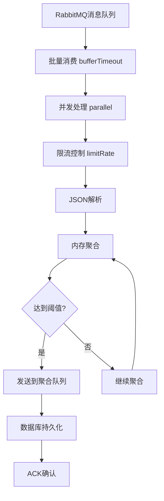

# 千万级数据实时统计系统技术方案

## 1. 整体实现框架

### 1.1 系统架构概览

本系统采用**响应式流处理架构**，基于Spring WebFlux + Reactor + R2DBC实现千万级数据的实时统计处理。整体架构分为四个核心层次：

```
┌─────────────────────────────────────────────────────────────┐
│                    数据源层 (Data Source)                    │
│  ┌─────────────┐  ┌─────────────┐  ┌─────────────┐         │
│  │   RabbitMQ  │  │   MySQL     │  │   外部API   │         │
│  │   消息队列   │  │   数据库     │  │   数据源     │         │
│  └─────────────┘  └─────────────┘  └─────────────┘         │
└─────────────────────────────────────────────────────────────┘
                              │
┌─────────────────────────────────────────────────────────────┐
│                   消息处理层 (Message Processing)            │
│  ┌─────────────────────────────────────────────────────────┐ │
│  │              MessageService (消息服务)                  │ │
│  │  • 批量消费 (bufferTimeout)                            │ │
│  │  • 并发处理 (parallel + customScheduler)               │ │
│  │  • 限流控制 (limitRate)                                │ │
│  │  • 错误重试 (retryWhen)                                │ │
│  └─────────────────────────────────────────────────────────┘ │
└─────────────────────────────────────────────────────────────┘
                              │
┌─────────────────────────────────────────────────────────────┐
│                   内存聚合层 (Memory Aggregation)            │
│  ┌─────────────────────────────────────────────────────────┐ │
│  │         MemoryAggregationService (内存聚合服务)         │ │
│  │  • 多维度聚合 (7种统计类型)                             │ │
│  │  • 内存缓存 (ConcurrentHashMap)                        │ │
│  │  • 阈值触发 (aggregationThreshold)                     │ │
│  │  • 超时处理 (timeoutCheckScheduler)                    │ │
│  └─────────────────────────────────────────────────────────┘ │
└─────────────────────────────────────────────────────────────┘
                              │
┌─────────────────────────────────────────────────────────────┐
│                   数据持久层 (Data Persistence)              │
│  ┌─────────────────────────────────────────────────────────┐ │
│  │              R2DBC Repository (响应式数据访问)          │ │
│  │  • 原子化操作 (ON DUPLICATE KEY UPDATE)                │ │
│  │  • 批量写入 (batch operations)                         │ │
│  │  • 连接池优化 (connection pooling)                     │ │
│  └─────────────────────────────────────────────────────────┘ │
└─────────────────────────────────────────────────────────────┘
```

### 1.2 核心处理流程

#### 1.2.1 消息消费流程


#### 1.2.2 内存聚合策略
系统支持同时多种统计维度的并行聚合：
- **响应率**
- **接通率**
.......

### 1.3 数据流转模式

1. **实时流处理**：消息从MQ队列实时消费，无延迟处理
2. **内存聚合**：在内存中按维度聚合数据，减少数据库压力
3. **阈值触发**：达到聚合阈值(1000条)或超时(1分钟)时触发持久化
4. **批量写入**：使用原子化操作批量写入数据库，保证数据一致性

## 2. 技术选型

### 2.1 核心技术栈

| 技术组件 | 版本 | 作用 | 优势 |
|---------|------|------|------|
| **Spring Boot** | 3.2.6 | 应用框架 | 自动配置、生产就绪 |
| **Spring WebFlux** | 3.2.6 | 响应式Web框架 | 非阻塞I/O、高并发 |
| **Project Reactor** | 3.x | 响应式编程库 | 背压控制、流式处理 |
| **R2DBC** | 1.0.5 | 响应式数据库访问 | 非阻塞数据库操作 |
| **Reactor RabbitMQ** | 1.5.6 | 响应式MQ客户端 | 非阻塞消息处理 |
| **MySQL** | 8.0+ | 关系型数据库 | 事务支持、数据一致性 |
| **Java** | 17+ | 编程语言 | 现代Java特性、性能优化 |

### 2.2 关键配置参数

#### 2.2.1 消息处理配置（配置化，调整参数优化处理效率）
```properties
# 并发消费者数量
concurrent-consumers=2

# 批处理大小
batch-size=100

# 批处理超时时间(秒)
batch-timeout-seconds=1

# 消息处理线程池最大线程数
scheduler-thread-cap=20

# 线程池队列容量
scheduler-queued-task-cap=500

# 限流速率(每秒处理消息数)
rate-limit=200
```

#### 2.2.2 数据库连接池配置
```properties
# 初始连接数
spring.r2dbc.pool.initial-size=10

# 最大连接数
spring.r2dbc.pool.max-size=50

# 最大空闲时间
spring.r2dbc.pool.max-idle-time=60s

# 最大获取时间
spring.r2dbc.pool.max-acquire-time=60s

# 最大生命周期
spring.r2dbc.pool.max-life-time=1800s
```

#### 2.2.3 内存聚合配置
```properties
# 内存聚合阈值
aggregation-threshold=1000

# 聚合超时时间(分钟)
aggregation-timeout-minutes=1

# 超时数据检查间隔(秒)
timeout-check-interval-seconds=5
```

### 2.3 性能优化技术

#### 2.3.1 响应式流处理
- **背压控制**：通过`limitRate`控制处理速率，防止内存溢出
- **并行处理**：使用`parallel()`和自定义调度器实现并发处理
- **批量操作**：通过`bufferTimeout`实现批量消费，提高吞吐量

#### 2.3.2 内存管理
- **内存聚合**：在内存中聚合数据，减少数据库访问频次
- **缓存策略**：使用`ConcurrentHashMap`实现线程安全的内存缓存
- **超时清理**：定时清理超时数据，防止内存泄漏

#### 2.3.3 数据库优化
- **原子化操作**：使用`ON DUPLICATE KEY UPDATE`实现原子化插入/更新
- **连接池优化**：合理配置连接池参数，提高数据库访问效率
- **批量写入**：减少数据库交互次数，提高写入性能

## 3. 需要注意的关键点

### 3.1 消息处理可靠性

#### 3.1.1 ACK机制问题
**问题**：系统负载过高时，消息重新入队，减轻系统压力

**解决方案**：
```java
if (currentCount > crmStatisticsConfig.getSchedulerQueuedTaskCap()) {
    messages.forEach(message -> message.nack(true)); // 重新入队
    return Mono.delay(Duration.ofMillis(200)).then(Mono.empty());
}
```

#### 3.1.2 错误处理策略
- **重试机制**：使用指数退避重试，避免雪崩效应
- **死信队列**：处理多次重试失败的消息
- **监控告警**：实时监控消息处理状态，及时发现问题

### 3.2 内存管理

#### 3.2.1 内存泄漏风险（假如每1000条聚合一次，每个key下面可能存留不够1000次的数据，使用时间来解决）
**风险点**：
- 内存聚合缓存无限增长
- 超时数据未及时清理
- 大对象未及时释放

**解决方案**：
```java
// 定时清理超时数据
private void startTimeoutCheckScheduler() {
    ScheduledExecutorService scheduler = Executors.newScheduledThreadPool(1);
    scheduler.scheduleAtFixedRate(() -> {
        cleanupTimeoutData();
    }, 0, crmStatisticsConfig.getTimeoutCheckIntervalSeconds(), TimeUnit.SECONDS);
}
```

#### 3.2.2 内存监控
- **JVM监控**：监控堆内存使用情况
- **缓存监控**：监控聚合缓存大小
- **GC优化**：合理配置GC参数，减少停顿时间

```shell
nohup java \
  -Xms2g -Xmx4g \
  -XX:+UnlockDiagnosticVMOptions \
  -XX:ErrorFile=./logs/hs_err_pid%p.log \
  -Xlog:gc*,gc+heap*,safepoint*:file=./gcs/gc.log:time,uptime,level,tags:filecount=10,filesize=50m \
  -XX:OnOutOfMemoryError='kill -3 %p' \
  -XX:+LogVMOutput \
  -XX:LogFile=./logs/vm_output.log \
  -XX:+HeapDumpOnOutOfMemoryError \
  -XX:HeapDumpPath=./dump.hprof \
  -jar "$APP_NAME" \
  > ./logs/console_stdout.log 2> ./logs/console_stderr.log &
```

### 3.3 数据一致性

#### 3.3.1 并发安全
- **原子操作**：使用`AtomicLong`、`AtomicInteger`等原子类
- **线程安全集合**：使用`ConcurrentHashMap`等线程安全集合
- **数据库锁**：使用`FOR UPDATE`避免并发更新问题

#### 3.3.2 事务处理
```java
// 原子化插入或更新，保证数据一致性
@Modifying
@Query("INSERT INTO account_rate (...) VALUES (...) ON DUPLICATE KEY UPDATE ...")
Mono<Void> upsertWithIncrement(AccountRate entity);
```
#### 3.3.3 程序挂钩（退出时内存数据处理）

```java
 @PreDestroy
    public void shutdown() {
        logger.info("开始关闭消息服务...");
        isRunning.set(false);

        // 标记所有消费者停止
        consumerStatus.values().forEach(status -> status.set(false));

        // 等待所有消息处理完成
        while (processingCount.get() > 0) {
            try {
                Thread.sleep(100);
            } catch (InterruptedException e) {
                Thread.currentThread().interrupt();
                break;
            }
        }

        // 强制刷新内存聚合缓存
        if (memoryAggregationService != null) {
            logger.info("强制刷新内存聚合缓存...");
            memoryAggregationService.shutdown();
        }

        logger.info("消息服务已关闭");
    }
```

### 3.4 性能调优

#### 3.4.1 系统参数调优
- **JVM参数**：`-Xms2g -Xmx4g -XX:+UseG1GC`
- **线程池配置**：根据CPU核数和I/O特性调整线程池大小
- **数据库参数**：优化MySQL连接数、缓冲池等参数

#### 3.4.2 监控指标
- **吞吐量**：每秒处理消息数
- **延迟**：消息处理平均延迟
- **错误率**：消息处理失败率
- **资源使用**：CPU、内存、数据库连接使用率

### 3.5 运维注意事项

#### 3.5.1 部署建议
- **容器化部署**：使用Docker进行容器化部署
- **资源限制**：合理设置CPU和内存限制
- **健康检查**：配置应用健康检查端点

#### 3.5.2 监控告警
- **应用监控**：使用Micrometer + Prometheus + Grafana
- **日志监控**：使用ELK Stack进行日志分析
- **业务监控**：监控关键业务指标

#### 3.5.3 故障处理
- **优雅关闭**：实现`@PreDestroy`方法，确保数据不丢失
- **故障恢复**：配置自动重启和故障转移
- **数据备份**：定期备份重要数据

## 4. 性能指标

### 4.1 预期性能指标
- **消息处理能力**：10,000+ 消息/秒
- **内存使用**：< 2GB (正常负载)
- **数据库连接**：< 50个并发连接
- **处理延迟**：< 100ms (P95)

### 4.2 扩展性考虑
- **水平扩展**：支持多实例部署
- **数据库分片**：支持按时间或业务维度分片
- **缓存优化**：可引入Redis等分布式缓存

## 5. 总结

本系统通过响应式编程、内存聚合、批量处理等技术手段，实现了千万级数据的实时统计处理。关键成功因素包括：

1. **架构设计**：采用响应式流处理架构，充分利用非阻塞I/O
2. **性能优化**：通过内存聚合和批量操作减少数据库压力
3. **可靠性保证**：完善的错误处理和重试机制
4. **监控运维**：全面的监控指标和告警机制

通过合理的技术选型和架构设计，系统能够稳定处理千万级数据，满足实时统计的业务需求。

