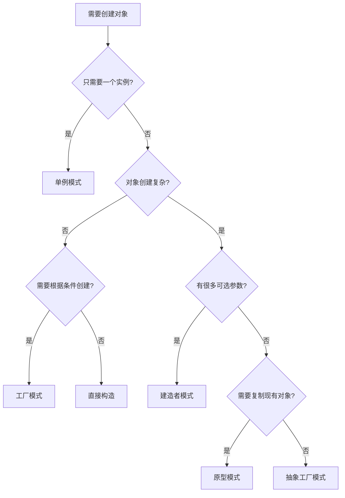

# Java设计模式实战：创建型模式深度解析

## 🎯 引言

创建型模式关注对象创建机制，试图创建适合情况的对象。这些模式将对象的创建过程抽象化，使系统独立于如何创建、组合和表示对象。

本文将深入解析最常用的创建型设计模式，结合Java 17的最新特性，提供企业级的实现方案。

## 📚 创建型模式概述

创建型模式主要解决以下问题：
- **对象创建的复杂性** - 简化对象的创建过程
- **创建过程的封装** - 隐藏对象创建的细节
- **灵活性增强** - 支持动态决定创建哪些对象
- **代码复用** - 减少重复的对象创建代码

### 创建型模式分类

| 模式名称 | 主要目的 | 适用场景 | 复杂度 |
|---------|---------|---------|-------|
| **单例模式** | 确保类只有一个实例 | 配置管理、日志记录、数据库连接池 | ⭐⭐ |
| **工厂模式** | 封装对象创建逻辑 | 对象类型需要根据条件决定 | ⭐⭐⭐ |
| **建造者模式** | 构建复杂对象 | 对象有多个可选参数 | ⭐⭐⭐⭐ |
| **原型模式** | 通过复制创建对象 | 对象创建成本高，需要大量相似对象 | ⭐⭐⭐ |
| **抽象工厂模式** | 创建相关对象族 | 需要创建一系列相关的对象 | ⭐⭐⭐⭐⭐ |

## 🔐 单例模式详解

### 模式定义

确保一个类只有一个实例，并提供全局访问点。

### 实现方式对比

#### 1. 饿汉式单例（推荐用于无延迟加载需求）

```java
@Slf4j
public class Singleton {
    // 类加载时即创建实例
    private static final Singleton INSTANCE = new Singleton();
    
    private Singleton() {
        log.info("创建单例实例：{}", this.hashCode());
    }
    
    public static Singleton getInstance() {
        return INSTANCE;
    }
}
```

**优势**：
- 线程安全
- 实现简单
- 无需同步

**劣势**：
- 无延迟加载
- 可能造成资源浪费

#### 2. 懒汉式单例（双重检查锁定）

```java
@Slf4j
public class LazySingleton {
    private static volatile LazySingleton instance;
    
    private LazySingleton() {
        log.info("创建懒汉式单例实例：{}", this.hashCode());
    }
    
    public static LazySingleton getInstance() {
        if (instance == null) {
            synchronized (LazySingleton.class) {
                if (instance == null) {
                    instance = new LazySingleton();
                }
            }
        }
        return instance;
    }
}
```

**关键技术点**：
- `volatile` 关键字确保多线程环境下的可见性
- 双重检查减少同步开销
- 延迟加载节省资源

#### 3. 枚举单例（强烈推荐）

```java
@Slf4j
public enum EnumSingleton {
    INSTANCE;
    
    EnumSingleton() {
        log.info("创建枚举单例实例：{}", this.hashCode());
    }
    
    public void doSomething(String message) {
        log.info("枚举单例执行业务逻辑：{}", message);
    }
}
```

**为什么推荐枚举单例**：
- 线程安全（JVM保证）
- 防止反射攻击
- 防止序列化攻击
- 代码简洁

### 最佳实践

```java
// 使用示例
public class SingletonDemo {
    public static void main(String[] args) {
        // 枚举单例的使用
        EnumSingleton.INSTANCE.doSomething("业务逻辑");
        
        // 验证单例特性
        EnumSingleton instance1 = EnumSingleton.INSTANCE;
        EnumSingleton instance2 = EnumSingleton.getInstance();
        assert instance1 == instance2; // 确保是同一实例
    }
}
```

## 🏭 工厂模式详解

### 简单工厂模式

适用于产品类型较少且固定的场景。

```java
public class SimpleFactory {
    public enum ProductType {
        PRODUCT_A, PRODUCT_B
    }
    
    public static Product createProduct(ProductType type) {
        return switch (type) {
            case PRODUCT_A -> new ConcreteProductA();
            case PRODUCT_B -> new ConcreteProductB();
        };
    }
}
```

**Java 17 Switch表达式**：
- 更简洁的语法
- 编译器确保所有分支都被覆盖
- 支持返回值

### 工厂方法模式

当需要扩展新产品类型时，使用工厂方法模式。

```java
// 抽象工厂
public abstract class Factory {
    public abstract Product createProduct();
    
    // 模板方法 - 定义产品使用流程
    public final Product getProduct() {
        Product product = createProduct();
        // 可以在这里添加通用的产品初始化逻辑
        return product;
    }
}

// 具体工厂
@Slf4j
public class ConcreteFactoryA extends Factory {
    @Override
    public Product createProduct() {
        log.info("工厂A创建产品A");
        return new ConcreteProductA();
    }
}
```

### 工厂模式应用场景

1. **数据库连接工厂**
```java
public class DatabaseConnectionFactory {
    public static Connection createConnection(DatabaseType type) {
        return switch (type) {
            case MYSQL -> DriverManager.getConnection("jdbc:mysql://...");
            case POSTGRESQL -> DriverManager.getConnection("jdbc:postgresql://...");
            case ORACLE -> DriverManager.getConnection("jdbc:oracle://...");
        };
    }
}
```

2. **消息处理器工厂**
```java
public class MessageProcessorFactory {
    public static MessageProcessor createProcessor(MessageType type) {
        return switch (type) {
            case EMAIL -> new EmailProcessor();
            case SMS -> new SmsProcessor();
            case PUSH -> new PushNotificationProcessor();
        };
    }
}
```

## 🏗️ 建造者模式详解

### 现代建造者模式（静态内部类）

这是目前最推荐的建造者模式实现方式。

```java
@Getter
@ToString
public class Computer {
    // 必需参数
    private final String cpu;
    private final String memory;
    
    // 可选参数
    private final String storage;
    private final String graphics;
    private final boolean hasWifi;
    private final boolean hasBluetooth;
    
    private Computer(Builder builder) {
        this.cpu = builder.cpu;
        this.memory = builder.memory;
        this.storage = builder.storage;
        this.graphics = builder.graphics;
        this.hasWifi = builder.hasWifi;
        this.hasBluetooth = builder.hasBluetooth;
    }
    
    public static class Builder {
        // 必需参数
        private final String cpu;
        private final String memory;
        
        // 可选参数 - 默认值
        private String storage = "500GB SSD";
        private String graphics = "集成显卡";
        private boolean hasWifi = true;
        private boolean hasBluetooth = false;
        
        public Builder(String cpu, String memory) {
            this.cpu = cpu;
            this.memory = memory;
        }
        
        public Builder storage(String storage) {
            this.storage = storage;
            return this;
        }
        
        public Builder graphics(String graphics) {
            this.graphics = graphics;
            return this;
        }
        
        public Builder wifi(boolean hasWifi) {
            this.hasWifi = hasWifi;
            return this;
        }
        
        public Builder bluetooth(boolean hasBluetooth) {
            this.hasBluetooth = hasBluetooth;
            return this;
        }
        
        public Computer build() {
            return new Computer(this);
        }
    }
}
```

### 使用示例

```java
// 创建高端游戏电脑
Computer gamingComputer = new Computer.Builder("Intel i9", "32GB DDR4")
        .storage("2TB NVMe SSD")
        .graphics("NVIDIA RTX 4090")
        .wifi(true)
        .bluetooth(true)
        .build();

// 创建办公电脑（使用默认配置）
Computer officeComputer = new Computer.Builder("Intel i5", "16GB DDR4")
        .build();
```

### 建造者模式的优势

1. **参数验证**
```java
public Computer build() {
    // 验证必需参数
    if (cpu == null || cpu.trim().isEmpty()) {
        throw new IllegalArgumentException("CPU不能为空");
    }
    if (memory == null || memory.trim().isEmpty()) {
        throw new IllegalArgumentException("内存不能为空");
    }
    
    return new Computer(this);
}
```

2. **不可变对象**
- 所有字段都是 `final` 的
- 只提供 `getter` 方法
- 线程安全

3. **流畅接口**
- 方法链调用
- 代码可读性强
- IDE友好的自动完成

### 传统建造者模式（Director + Builder）

当需要创建多种预定义配置的产品时，可以使用Director。

```java
@Slf4j
@AllArgsConstructor
public class Director {
    private ProductBuilder builder;
    
    public ComplexProduct constructStandardProduct() {
        log.info("开始构建标准产品");
        builder.buildPartA();
        builder.buildPartB();
        builder.addFeature("标准特性1");
        builder.addFeature("标准特性2");
        return builder.getProduct();
    }
    
    public ComplexProduct constructAdvancedProduct() {
        log.info("开始构建高级产品");
        builder.buildPartA();
        builder.buildPartB();
        builder.buildPartC();
        builder.addFeature("高级特性1");
        builder.addFeature("高级特性2");
        builder.addFeature("高级特性3");
        return builder.getProduct();
    }
}
```

## 🚀 现代Java特性在创建型模式中的应用

### Record类的应用

Java 14引入的Record类非常适合创建不可变的数据载体。

```java
// 使用Record创建简单的不可变对象
public record ProductInfo(
    String name,
    String version,
    double price,
    List<String> features
) {
    // 紧凑构造器 - 参数验证
    public ProductInfo {
        if (name == null || name.trim().isEmpty()) {
            throw new IllegalArgumentException("产品名称不能为空");
        }
        if (price < 0) {
            throw new IllegalArgumentException("价格不能为负数");
        }
        // 防御性复制
        features = List.copyOf(features);
    }
    
    // 工厂方法
    public static ProductInfo createBasic(String name, double price) {
        return new ProductInfo(name, "1.0", price, List.of());
    }
}
```

### 密封类的应用

Java 17的密封类可以用于限制工厂模式中的产品类型。

```java
// 密封类 - 限制可能的实现
public sealed interface PaymentMethod 
    permits CreditCard, DebitCard, DigitalWallet {
    
    void processPayment(double amount);
}

// 具体实现
public final class CreditCard implements PaymentMethod {
    public void processPayment(double amount) {
        // 信用卡支付逻辑
    }
}

public final class DebitCard implements PaymentMethod {
    public void processPayment(double amount) {
        // 借记卡支付逻辑
    }
}

public final class DigitalWallet implements PaymentMethod {
    public void processPayment(double amount) {
        // 数字钱包支付逻辑
    }
}

// 工厂类
public class PaymentMethodFactory {
    public static PaymentMethod createPaymentMethod(String type) {
        return switch (type.toUpperCase()) {
            case "CREDIT" -> new CreditCard();
            case "DEBIT" -> new DebitCard();
            case "WALLET" -> new DigitalWallet();
            default -> throw new IllegalArgumentException("不支持的支付方式: " + type);
        };
    }
}
```

## 🎯 性能优化与最佳实践

### 单例模式性能优化

1. **避免过度同步**
```java
// 使用枚举单例，避免同步开销
public enum ConfigManager {
    INSTANCE;
    
    private final Properties config = new Properties();
    
    ConfigManager() {
        // 初始化配置
        loadConfiguration();
    }
    
    private void loadConfiguration() {
        // 从文件或数据库加载配置
    }
    
    public String getProperty(String key) {
        return config.getProperty(key);
    }
}
```

2. **内存优化**
```java
// 使用弱引用缓存单例实例
public class CacheManager {
    private static volatile WeakReference<CacheManager> instanceRef;
    
    public static CacheManager getInstance() {
        CacheManager instance = instanceRef != null ? instanceRef.get() : null;
        if (instance == null) {
            synchronized (CacheManager.class) {
                instance = instanceRef != null ? instanceRef.get() : null;
                if (instance == null) {
                    instance = new CacheManager();
                    instanceRef = new WeakReference<>(instance);
                }
            }
        }
        return instance;
    }
}
```

### 工厂模式性能优化

1. **缓存实例**
```java
public class CachedFactory {
    private static final Map<ProductType, Product> CACHE = 
        new ConcurrentHashMap<>();
    
    public static Product createProduct(ProductType type) {
        return CACHE.computeIfAbsent(type, t -> switch (t) {
            case PRODUCT_A -> new ConcreteProductA();
            case PRODUCT_B -> new ConcreteProductB();
        });
    }
}
```

2. **延迟初始化**
```java
public class LazyFactory {
    private static final Map<ProductType, Supplier<Product>> SUPPLIERS = 
        Map.of(
            ProductType.PRODUCT_A, ConcreteProductA::new,
            ProductType.PRODUCT_B, ConcreteProductB::new
        );
    
    public static Product createProduct(ProductType type) {
        Supplier<Product> supplier = SUPPLIERS.get(type);
        if (supplier == null) {
            throw new IllegalArgumentException("不支持的产品类型: " + type);
        }
        return supplier.get();
    }
}
```

### 建造者模式性能优化

1. **对象池**
```java
public class Computer {
    public static class Builder {
        // 重用Builder实例
        private static final ThreadLocal<Builder> BUILDER_POOL = 
            ThreadLocal.withInitial(Builder::new);
        
        public static Builder newBuilder(String cpu, String memory) {
            Builder builder = BUILDER_POOL.get();
            builder.reset();
            builder.cpu = cpu;
            builder.memory = memory;
            return builder;
        }
        
        private void reset() {
            // 重置所有字段到默认值
            this.storage = "500GB SSD";
            this.graphics = "集成显卡";
            this.hasWifi = true;
            this.hasBluetooth = false;
        }
    }
}
```

## 📊 模式选择指南

### 决策树



### 应用场景总结

| 场景 | 推荐模式 | 理由 |
|------|---------|------|
| 配置管理 | 枚举单例 | 全局唯一，线程安全 |
| 数据库连接池 | 饿汉式单例 | 需要预初始化 |
| 日志记录器 | 懒汉式单例 | 延迟加载，节省资源 |
| 对象创建依赖外部条件 | 工厂方法 | 封装创建逻辑 |
| API响应对象构建 | 建造者模式 | 参数众多，需要验证 |
| 缓存对象创建 | 原型模式 | 避免重复初始化 |

## 🔧 测试策略

### 单例模式测试

```java
@Test
@DisplayName("多线程环境下单例应该保持一致")
void testSingletonThreadSafety() throws InterruptedException {
    int threadCount = 100;
    CountDownLatch latch = new CountDownLatch(threadCount);
    Set<Integer> hashCodes = ConcurrentHashMap.newKeySet();
    
    for (int i = 0; i < threadCount; i++) {
        new Thread(() -> {
            try {
                EnumSingleton instance = EnumSingleton.INSTANCE;
                hashCodes.add(instance.hashCode());
            } finally {
                latch.countDown();
            }
        }).start();
    }
    
    latch.await(5, TimeUnit.SECONDS);
    assertThat(hashCodes).hasSize(1); // 所有实例应该有相同的hashCode
}
```

### 建造者模式测试

```java
@Test
@DisplayName("建造者应该创建不可变对象")
void testBuilderImmutability() {
    Computer computer = new Computer.Builder("Intel i7", "16GB")
            .build();
    
    // 验证不可变性
    assertThat(computer.getCpu()).isEqualTo("Intel i7");
    assertThat(computer.getMemory()).isEqualTo("16GB");
    
    // 尝试修改应该不影响原对象（如果有防御性复制）
    // 这里的Computer类字段都是final的，从编译期就保证了不可变性
}
```

## 📈 总结

创建型模式是面向对象设计的基础，掌握这些模式能够：

1. **提高代码质量** - 通过封装对象创建逻辑
2. **增强可维护性** - 便于扩展和修改
3. **改善性能** - 通过单例和对象池等技术
4. **提升安全性** - 通过不可变对象和线程安全设计

### 关键要点

- **单例模式**：优先使用枚举实现，注意线程安全
- **工厂模式**：结合Java 17的密封类和Switch表达式
- **建造者模式**：使用静态内部类，创建不可变对象
- **性能优化**：合理使用缓存、对象池和延迟初始化
- **测试策略**：重点测试线程安全性和不可变性

通过合理应用这些创建型模式，我们能够构建出更加健壮、可扩展和高性能的Java应用程序。

## 🔗 相关资源

- [项目源代码](https://github.com/Rise1024/Java-Labs/tree/main/java-design-patterns#readme)
- [Java设计模式系列文章](../README.md)
- [牛逼的博客网站](https://dongsheng.online)
